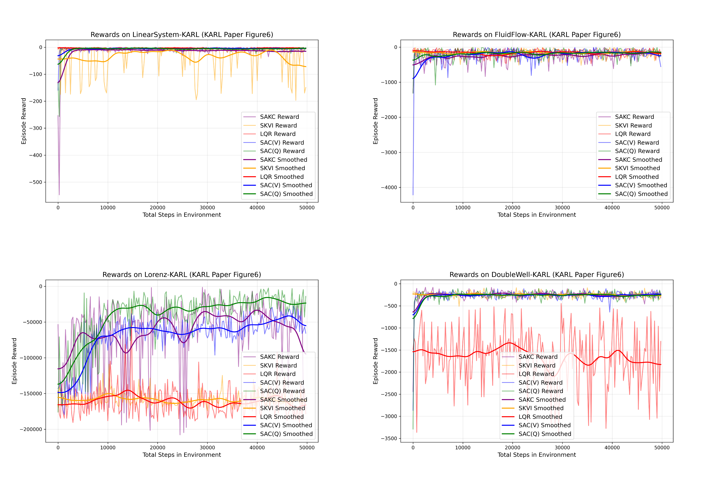

# KARL Experiments Reproduction

This repository contains a **partial reproduction of the numerical experiments** presented in the paper:

> **Koopman-Assisted Reinforcement Learning**  
> Preston Rozwood, Edward Mehrez, Ludger Paehler, Wen Sun, and Steven L. Brunton  
> [arXiv:2403.02290](https://arxiv.org/abs/2403.02290)

The goal of this project is to reproduce and explore the performance of the reinforcement learning algorithms introduced in the paper, with a particular focus on **Soft Koopman Value Iteration (SKVI)** and **Soft Actor Koopman-Critic (SAKC)**.

The repository currently implements four dynamical-system environments and compares several Koopman-based and conventional control/RL algorithms.

## Implemented Algorithms

The following algorithms are included:

- **SAKC** — Soft Actor Koopman-Critic
- **SKVI** — Soft Koopman Value Iteration
- **SAC(V)** — Soft Actor-Critic with a value-function formulation
- **SAC(Q)** — Soft Actor-Critic with a Q-function formulation
- **LQR** — Linear Quadratic Regulator, used as a benchmark controller

The corresponding agent implementations are:

```text
sakc_agent.py
skvi_agent.py
sac_v_agent.py
sac_q_agent.py
```

LQR is implemented directly inside the environment training scripts rather than as a separate agent file.

## Environments

Experiments are implemented for the four dynamical systems considered in the KARL paper:

1. **Linear System**
2. **Fluid Flow**
3. **Lorenz System**
4. **Double-Well Potential**

The corresponding training scripts are:

```text
linear_system_training.py
fluid_flow_training.py
Lorenz_training.py
double_well_training.py
```

Each training script defines the corresponding environment and evaluates the implemented algorithms under the same general experimental framework.

## Repository Structure

```text
KARL-experiments-reproduction/
├── linear_system_training.py
├── fluid_flow_training.py
├── Lorenz_training.py
├── double_well_training.py
│
├── sakc_agent.py
├── skvi_agent.py
├── sac_v_agent.py
├── sac_q_agent.py
│
├── reward_curves.png
└── README.md
```

During training, additional folders may be generated for saved models and reward data.

## Experiment Workflow

For the Koopman-based methods, state-transition data are first collected from the environment and used to construct a finite-dimensional approximation of the controlled Koopman operator.

The resulting Koopman representation is then used by:

- **SKVI** to perform value iteration in the lifted feature space.
- **SAKC** to incorporate the Koopman model into the critic component of the actor-critic framework.

The Koopman-based methods are compared with conventional **SAC(V)**, **SAC(Q)**, and the **LQR** benchmark.

For each environment, episodic rewards are recorded throughout the experiment and used to compare the performance of the five methods.

## Results

The repository includes a reward-curve comparison figure containing four subplots, corresponding to the four environments.

Each subplot compares the episodic rewards obtained by:

- SAKC
- SKVI
- SAC(V)
- SAC(Q)
- LQR

The current results represent intermediate reproduction experiments rather than final benchmark results.

> **Note:** The numerical results are still being optimized. Hyperparameters, Koopman dictionary configurations, training procedures, and other implementation details may continue to change in future updates.

The repository will be updated as the reproduction results improve and additional experiments are completed.

```markdown

```

## Requirements

The implementation is written in Python and mainly relies on:

```text
numpy
torch
gymnasium
matplotlib
scipy
control
```

The exact package versions have not yet been fixed and may be specified in a future `requirements.txt`.

## Running the Experiments

Each environment can be trained independently by running its corresponding training script. For example:

```bash
python linear_system_training.py
```

or

```bash
python fluid_flow_training.py
```

Similarly:

```bash
python Lorenz_training.py
python double_well_training.py
```

Depending on the experiment, the scripts may generate saved model parameters, reward data, and reward-curve plots.

## Project Status

This repository is currently **a work in progress**.

The main objective at this stage is to reproduce the qualitative behavior and algorithm comparisons reported in the KARL paper. The current numerical results should therefore not be interpreted as an exact reproduction of the results reported by the original authors.

Future updates may include:

- Further hyperparameter tuning
- Improved Koopman tensor construction
- More stable training configurations
- Improved agreement with the results reported in the paper
- Additional evaluation and visualization
- Cleaner experiment configuration and dependency management

## Reference

If you are interested in the original method and experimental setup, please refer to:

```bibtex
@article{rozwood2024koopman,
  title={Koopman-Assisted Reinforcement Learning},
  author={Rozwood, Preston and Mehrez, Edward and Paehler, Ludger and Sun, Wen and Brunton, Steven L.},
  journal={arXiv preprint arXiv:2403.02290},
  year={2024}
}
```

## Acknowledgements

This project is an independent reproduction and implementation effort based on the methods and experiments described in the original KARL paper.

The original KARL algorithms and experimental designs are credited to the authors of **Koopman-Assisted Reinforcement Learning**.
